

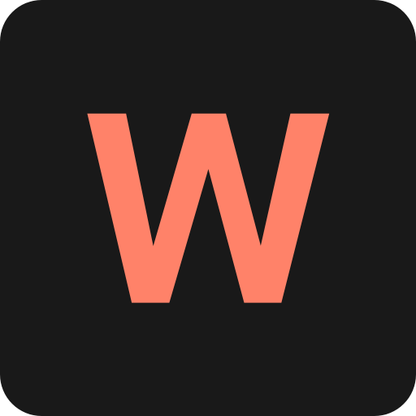</h1>
   
<h1>{ ...Will }</h1> 

## Descrição

### Refatorei o meu portfolio utilizando ``Next.js 13``. Agora, todos os dados presentes no portfolio são buscados de uma [API](https://github.com/renovatt/portfolio-api.git) externa que ``desenvolvi exclusivamente`` para este projeto. Essa abordagem torna o ``portfolio mais dinâmico``, eliminando a necessidade de atualizações manuais dos projetos e habilidades diretamente no portfolio. Além da refatoração, ``realizei melhorias na estrutura`` dos componentes e ``implementei novas features``, incluindo uma rota de contatos. Agora, qualquer pessoa pode me enviar uma mensagem ou entrar em contato por meio de diferentes opções disponíveis. Essas mudanças visam proporcionar uma experiência mais ``interativa e eficiente`` para os visitantes do portfolio.

[Ver Projeto](https://portfolio-renovatt.vercel.app/)

#

## Layout web
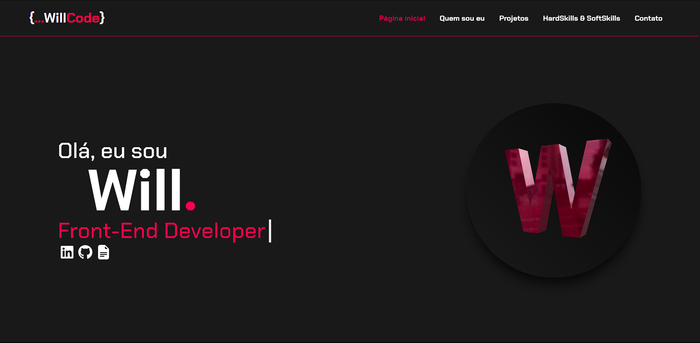 
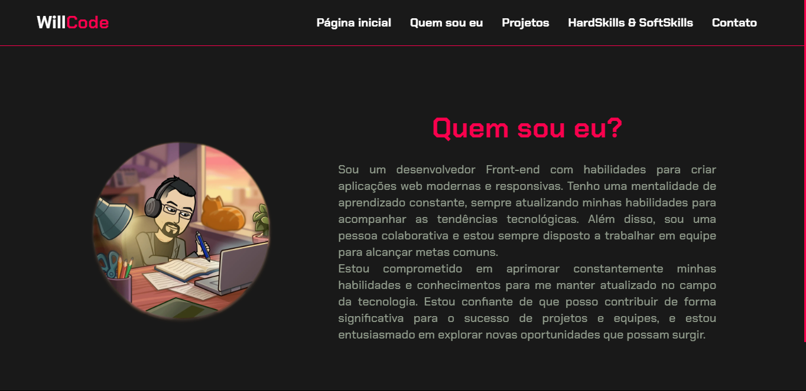
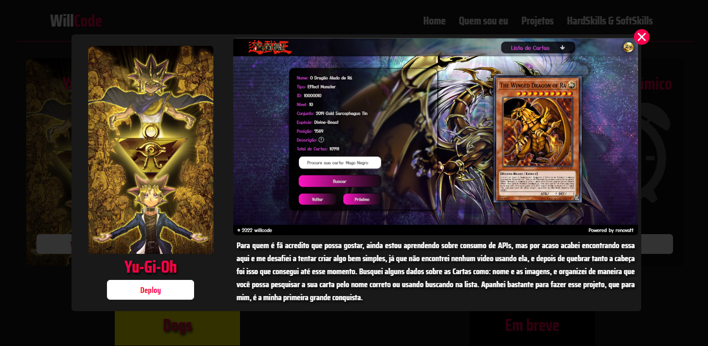
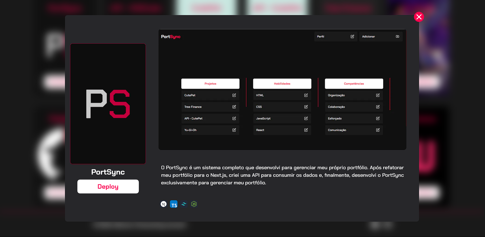
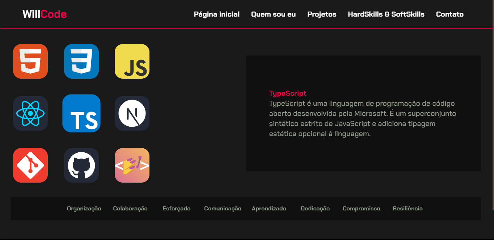
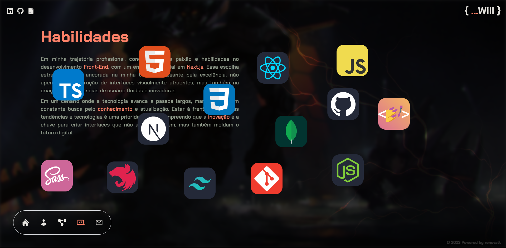
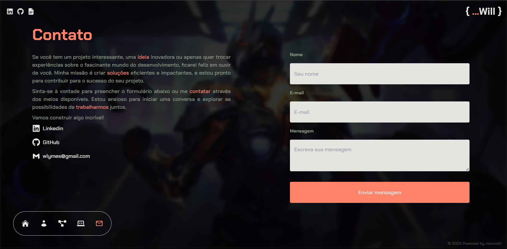

## Layout mobile
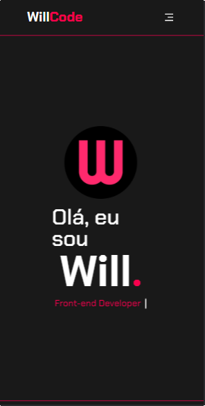
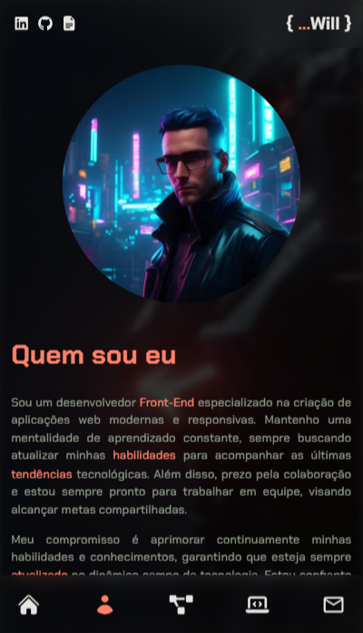
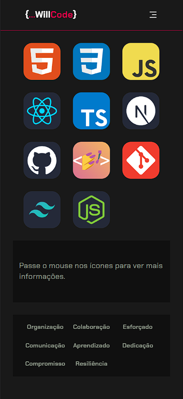

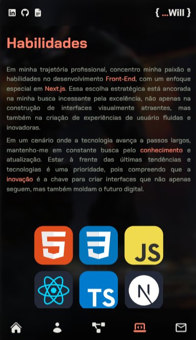
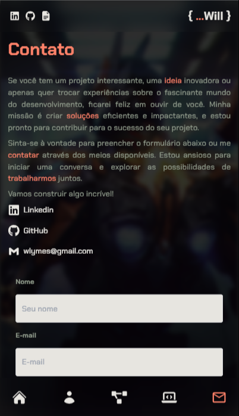

 

## ✨ Atualizações recentes

- **Refatoração total, adotei um estilo ``Mecha`` com um incrível modelo 3D para trazer algo mais realista no meu portfolio, junto com o framer motion para dar um toque de suavidade nas transições, eu particularmente adorei esse novo designer.**

- **Implementação de interceptação de rotas e criação de rotas estáticas**: Implementei a interceptação de rotas e criei [rotas estáticas](https://nextjs.org/docs/app/building-your-application/routing/dynamic-routes) para os projetos usando a funcionalidade de [Rotas Paralelas](https://nextjs.org/docs/app/building-your-application/routing/parallel-routes) do [Next.js](https://nextjs.org). Isso garante um carregamento inicial suave, sem carregamentos adicionais ao navegar entre as páginas, pois todas as páginas são pré-carregadas durante a construção `(build)`. O melhor de tudo é que a experiência é semelhante a um modal, mas, na verdade, é uma navegação contínua com URLs compartilháveis.

- **SEO dinâmico implementado nas rotas estáticas**: Cada rota estática agora inclui o nome do projeto no título da página, e ao compartilhar uma página, cada projeto terá sua própria miniatura com seu nome e descrição.

<!-- - **Refatoração na rota [HardSkills & SoftSkills](https://portfolio-renovatt.vercel.app/views/skills_softskills)**: Os ícones foram refatorados para melhorar a manutenção e a estruturação do código. Os componentes envolvidos foram separados, e agora o [zustand](https://zustand-demo.pmnd.rs/) é usado para melhor gerenciamento de estado ao interagir com os ícones `(hover/toque)`. -->

<!-- - **Pattern Composition aplicado aos componentes Card e ProjectDetails**: Implementei o Pattern Composition nos componentes Card e ProjectDetails, resultando em componentes reutilizáveis sem a necessidade de extensas tipagens para funções, imagens, etc. Isso resulta em um código mais limpo, organizado e bem estruturado. -->

- **Melhoria na obtenção de dados com react-query**: Alterei o método de obtenção de dados usando o [react-query](https://tanstack.com/query/latest/docs/react/overview), proporcionando vantagens em otimização e cache, tornando os dados mais acessíveis e resultando em `hooks` mais limpos.

## 🛠️ Tecnologias

💻 **Front-end**
- [Next.js 14.0.1](https://nextjs.org)
- [Typescript](https://www.typescriptlang.org)

📚 **Bibliotecas**
- [zustand](https://zustand-demo.pmnd.rs/)
- [zod](https://zod.dev/)
- [react-query](https://tanstack.com/query/latest/docs/react/overview)
- [next-pwa](https://www.npmjs.com/package/next-pwa)
- [react-hook-form](https://react-hook-form.com/)
- [react-toastify](https://www.npmjs.com/package/react-toastify)
- [react-icons](https://react-icons.github.io/react-icons/)
- [framer-motion](https://www.framer.com/motion/)
- [animate.style](https://animate.style/)
- [react-three-fiber](https://docs.pmnd.rs/react-three-fiber/getting-started/introduction)

🎨 **Estilização**
- [tailwindcss](https://tailwindcss.com/docs/installation)

🔋 **Versionamento e Deploy**
- [Git](https://git-scm.com)
- [Vercel](https://vercel.com/)

 

⚙️ **Configuranções e Instalações**

Clone do Projeto

    $ git clone https://github.com/renovatt/portfolio.git

Instalando as dependências

    $ npm install

Iniciando o projeto

    $ npm run dev

 

**Como contribuir?**

- Você pode dar suporte me seguindo aqui no GitHub
- Dando uma estrela no projeto
- Criar uma conexão comigo no linkedin fazendo parte da minha networking e curtir o meu projeto.

 

**Autor**
[Wildemberg Renovato de Lima](https://www.linkedin.com/in/renovatt/)