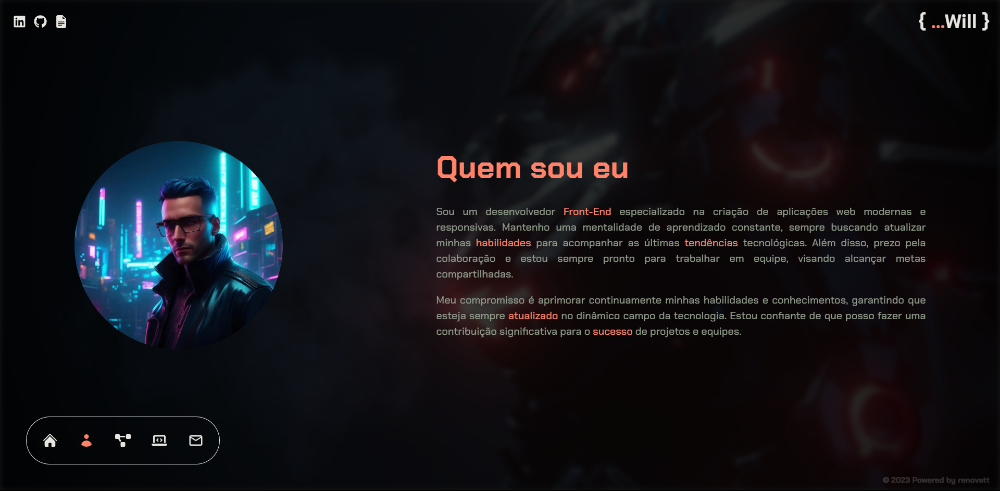

</h1>
   
<h1>WillCode</h1> 

## Descrição

### Refatorei o meu portfolio utilizando Next.js 13. Agora, todos os dados presentes no portfolio são buscados de uma [API](https://github.com/renovatt/portfolio-api.git) externa que desenvolvi exclusivamente para este projeto. Essa abordagem torna o portfolio mais dinâmico, eliminando a necessidade de atualizações manuais dos projetos e habilidades diretamente no portfolio. Além da refatoração, realizei melhorias na estrutura dos componentes e implementei novas features, incluindo uma rota de contatos. Agora, qualquer pessoa pode me enviar uma mensagem ou entrar em contato por meio de diferentes opções disponíveis. Essas mudanças visam proporcionar uma experiência mais interativa e eficiente para os visitantes do portfolio.

[Ver Projeto](https://portfolio-renovatt.vercel.app/)

#

## Layout mobile

## Layout web
 

 

## 🛠️ Tecnologias

💻 **Front-end**
- [Next.js 13.4](https://nextjs.org)
- [Typescript](https://www.typescriptlang.org)

📚 **Bibliotecas**
- [zod](https://zod.dev/)
- [next-pwa](https://www.npmjs.com/package/next-pwa)
- [react-hook-form](https://react-hook-form.com/)
- [react-toastify](https://www.npmjs.com/package/react-toastify)
- [react-icons](https://react-icons.github.io/react-icons/)

🎨 **Estilização**
- [tailwindcss](https://tailwindcss.com/docs/installation)

🔋 **Versionamento e Deploy**
- [Git](https://git-scm.com)
- [Vercel](https://vercel.com/)

 

⚙️ **Configuranções e Instalações**

Clone do Projeto

    $ git clone https://github.com/renovatt/portfolio.git

Instalando as dependências

    $ npm install

Iniciando o projeto

    $ npm run dev

 

**Como contribuir?**

- Você pode dar suporte me seguindo aqui no GitHub
- Dando uma estrela no projeto
- Criar uma conexão comigo no linkedin fazendo parte da minha networking e curtir o meu projeto.

 

**Autor**
[Wildemberg Renovato de Lima](https://www.linkedin.com/in/renovatt/)