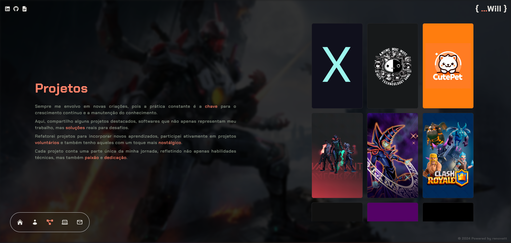
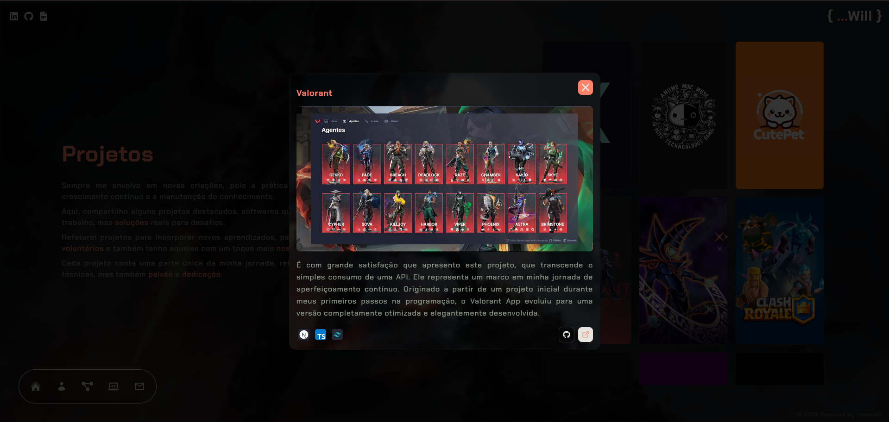

    
    
    

#

<h1>Meu Portfolio    
</h1>

## Descrição

[Ver Projeto](https://portfolio-renovatt.vercel.app/)

#### Dei uma repaginada no meu portfolio depois que conheci o React, para mim, é uma grande realização. Consegui deixar de mais dinâmico e atraente, estou usando `Json-Server` (Uma API Fake) para reduzir a quantidade de código, agora posso apenas acrescentar meus projetos no `db.json` e os cards vão ser criados automaticamente. 

#

## Layout mobile

## Layout web
   

 

# Tecnologias

<ul>
    <li style="list-style: none;">
    <a href="https://create-react-app.dev/" target="_blank">ReactJS</a></li>
    <li style="list-style: none;">
    <a href="https://reactrouter.com/" target="_blank">React Router</a></li>
    <li style="list-style: none;">
    <a href="https://www.npmjs.com/package/json-server" target="_blank">Json-Server</a></li>
    <li style="list-style: none;">
    <a href="https://styled-components.com/" target="_blank">Styled-Components</a></li>
</ul>

 

# ℹ️ Como usar

    Clone esse repositório
    $ git clone https://github.com/renovatt/portfolio.git

    Instalar dependências
    $ npm install

    Inicie o projeto
    $ npm start

 

# Como contribuir?

#### Você pode dar suporte me seguindo aqui no GitHub, dando uma estrela no projeto ou criar uma conexão comigo no Linkedin, fazendo parte da minha Networking e curtir o meu projeto.

 

# Autor

### Criado por <a href="https://www.linkedin.com/in/renovatt/" target="_blank">*Wildemberg Renovato de Lima*</a>